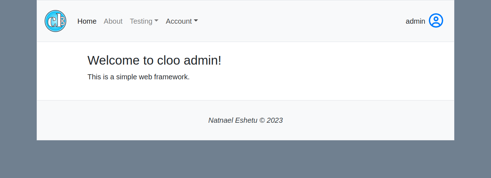

# README

## Cloo web framework v1.1.5

[docs](docs/index.md) | 
[license](LICENSE)

  Cloo is a light-weight web framework that comes
  packed with 3rd party libraries such as bootstrap, 
  jquery-ui and fontawesome intended for easier development of
  static and dynamic websites.
  A [smarty](https://www.smarty.net/) like syntax template system is provided for ease of use 
  of PHP code in the frontend.

## setup

copy this project directory to where your web server can access them. eg. in `/var/www/html/cloo/`. Then edit `config/site.ini` and modify the  `name` and `base_url`.

